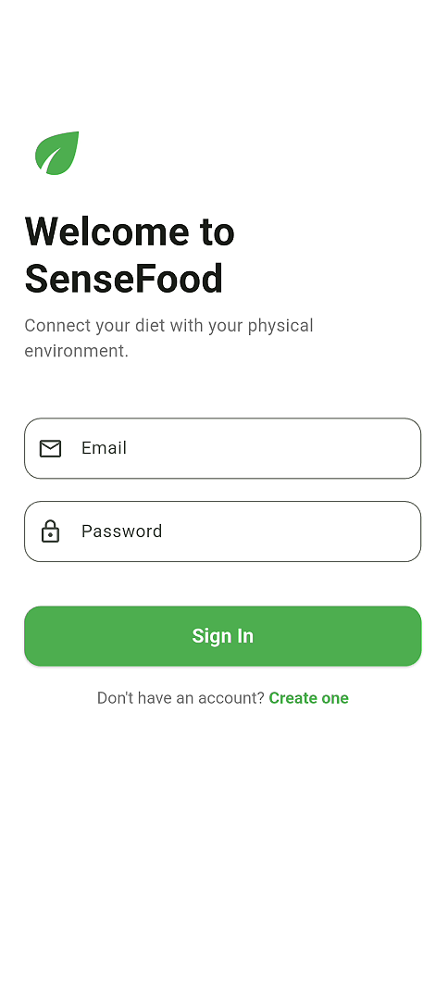
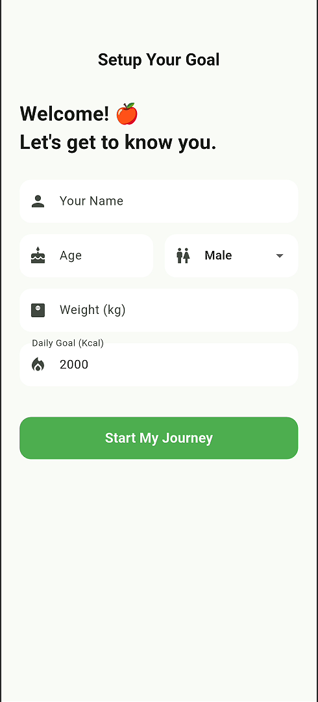
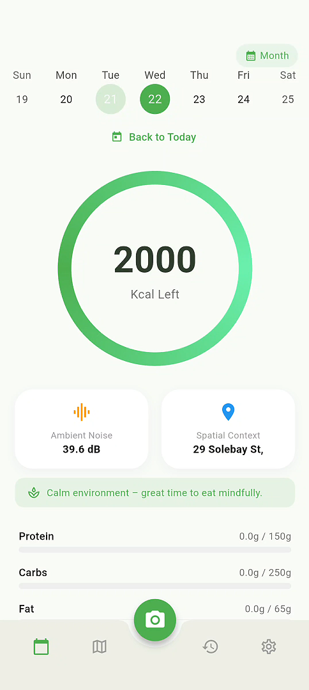
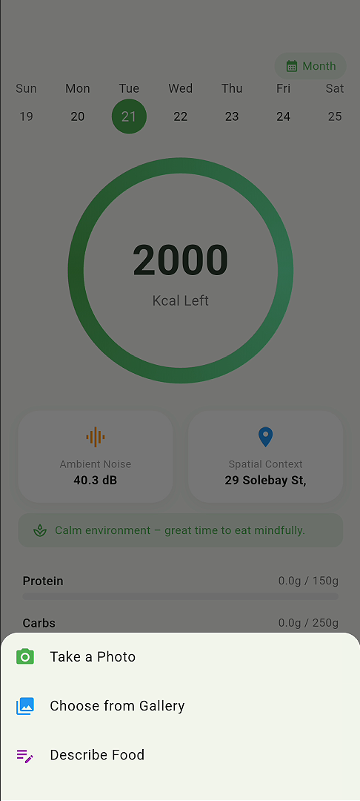
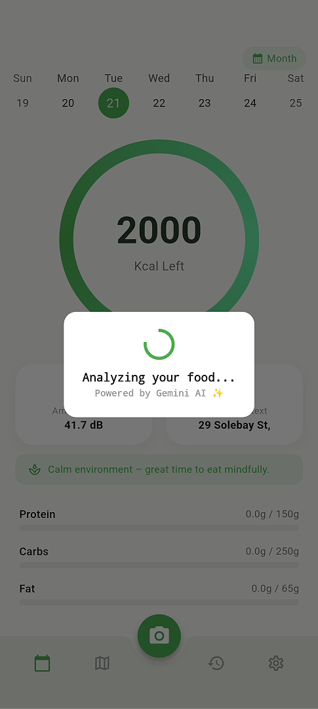
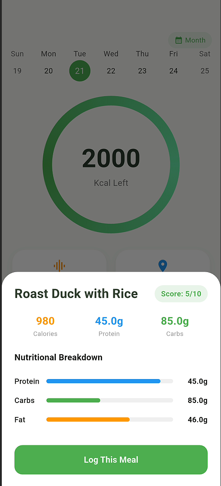
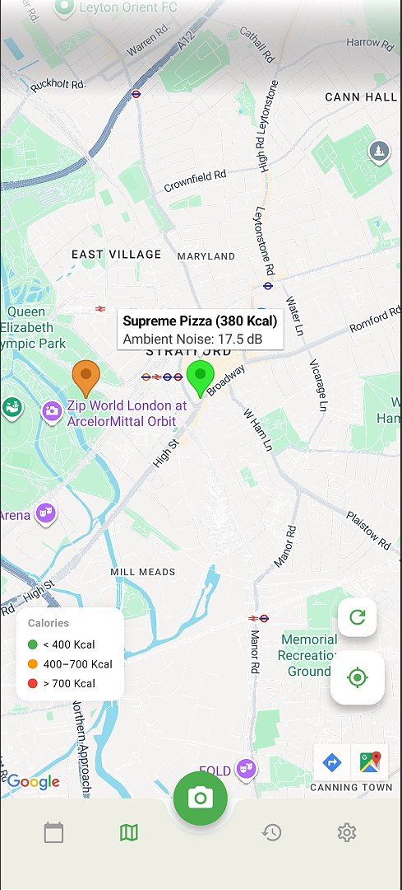
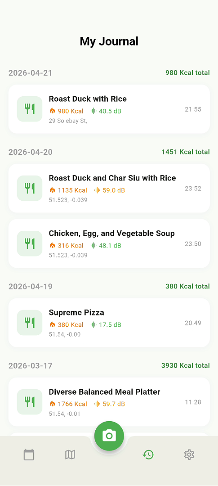
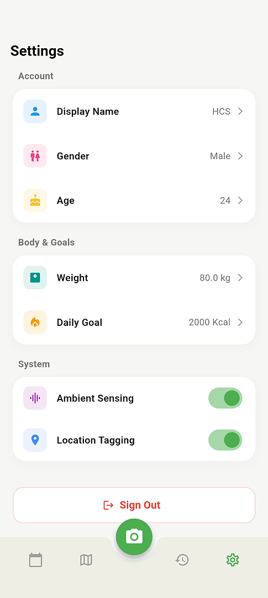

# SenseFood 🌿

> Connect your diet with your physical environment.

SenseFood is a Flutter mobile application developed for CASA0015: Mobile Systems & Interactions. It bridges the gap between nutrition tracking and ambient environmental sensing — when you log a meal, the app simultaneously captures your location and ambient noise level, creating a rich picture of **where** and **how** you eat.

---

## Download

[](https://github.com/HCSSSSSS/casa0015-mobile-assessment/releases/latest)

---
## 📱 Demo Video

https://github.com/HCSSSSSS/casa0015-mobile-assessment/raw/main/showcase/media/demo.mp4

---

## 🎯 The Problem

Most food tracking apps focus solely on what you eat — calories, macros, portions. 
But research in eating behaviour shows that *where* and *how* you eat profoundly 
shapes satisfaction and intake: noisy environments accelerate eating pace, 
and location patterns reveal habits that pure nutrition logs miss.

SenseFood addresses this gap by fusing food logging with passive environmental 
sensing. Every meal is automatically tagged with ambient noise level (dB) and 
GPS location, turning a flat calorie diary into a contextual map of your eating 
patterns.

---

## ✨ Features

- **AI Vision Analysis** — Photo or text input via Gemini 2.5 Flash multimodal API; returns calories, protein, carbs and fat
- **Connected Environment Sensing** — Real-time acoustic (dB) and spatial (GPS) data captured and stored at every meal
- **Ambient-Aware Dashboard** — Calorie progress ring with environmental feedback, noise advice, and interactive calendar
- **Monthly Heat Map** — Calorie intake intensity visualised across the full month via custom calendar builders
- **Meal Map** — Google Maps markers colour-coded by calorie level; click to view food name, noise and timestamp
- **My Journal** — Chronological meal history grouped by date, with decibel and location context per entry
- **Personalised Goals** — Onboarding captures weight, age and daily calorie target; synced to Firestore
- **Secure & Cross-device** — Firebase Auth + Firestore cloud persistence; API keys protected via `.env`

---

## 🛠 Tech Stack

| Layer | Technology |
|---|---|
| Framework | Flutter (Dart) |
| AI | Google Gemini 2.5 Flash |
| Backend | Firebase Auth + Cloud Firestore |
| Sensors | `geolocator`, `noise_meter`, `geocoding` |
| Maps | Google Maps Flutter SDK |
| State | Provider |
| Security | `flutter_dotenv` |

---

## 🚀 Getting Started

### Prerequisites
- Flutter SDK ≥ 3.10.7
- A Firebase project with Auth and Firestore enabled
- Google Gemini API key
- Google Maps API key

### Setup

```bash
git clone https://github.com/HCSSSSSS/casa0015-mobile-assessment.git
cd casa0015-mobile-assessment
flutter pub get
```

Create a `.env` file in the project root:

```
GEMINI_API_KEY=your_gemini_key_here
```

Create `android/local.properties` and add:

```
MAPS_API_KEY=your_maps_key_here
```

Replace `android/app/google-services.json` with your own Firebase config file.

```bash
flutter run
```

---

## 📸 Screenshots

| Login | Onboarding | Dashboard |
|---|---|---|
|  |  |  |

| Camera Menu | AI Analyzing | AI Result |
|---|---|---|
|  |  |  |

| Map | Journal | Settings |
|---|---|---|
|  |  |  |

---

## 📁 Project Structure

- `lib/main.dart` — App entry, navigation, dashboard
- `lib/providers/sensor_provider.dart` — Global state: sensors, calories, nutrients
- `lib/screens/login_screen.dart` — Sign in / Register
- `lib/screens/onboarding_screen.dart` — First-time setup
- `lib/screens/map_screen.dart` — Meal map
- `lib/screens/journal_screen.dart` — Meal history
- `lib/screens/settings_screen.dart` — Profile & goals
- `lib/service/ai_service.dart` — Gemini API integration
- `lib/service/database_service.dart` — Firestore read/write

---

## 🔒 Security

- API keys stored in `.env` (gitignored)
- `firebase_options.dart` excluded from version control
- Firestore rules require authenticated users only

---

## 📄 License

MIT
